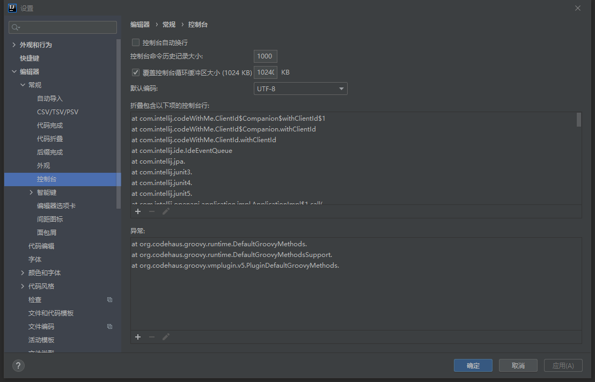

# EugeneLanguage

### 关键字定义

1. fn: 函数 -> 可独立使用的函数
2. def: 方法 -> 隶属于对象的方法

### 配置

#### 必要

* CLI arguments(启动参数)

```
  workbench/eugene/Bootstrap.eugene
```

-----

#### 非必要

* Console Configuration
  
  